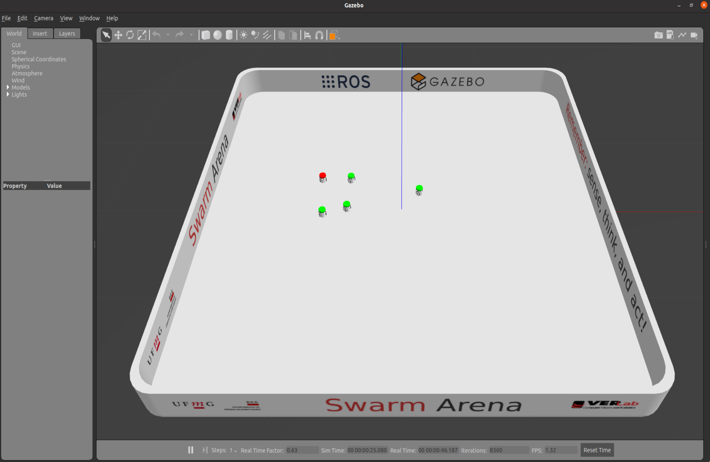

# fish_school_ground_truth

## Tracking data
 
`fish_school_ground_truth` contains the tracking data (inside `tracking_data` folder) used in the paper "A data-driven procedure for modeling collective behavior" by de Andrade et al. (2024).

The authors would like to thank Dr. Jolle W. Jolles for the authorization to use his channel's video: https://youtu.be/gZ1rRRYSioc

## Examples of application

### Swarm of two-wheeled differential drive robots ([HeRo](https://verlab.github.io/hero_common/))



For the installation, please visit the official HeRo documentation page [here](https://verlab.github.io/hero_common/installation/).

After the installation:
  1. Inside `hero_common/hero_examples/launch` you paste our `example_hero.launch` file.
  2. Inside `hero_common/hero_examples/scripts` you paste our `example_hero_*.py` and `utils.py` files, where `*` stands for 0,1,2,3, and 4.
  3. Inside `hero_common/hero_gazebo/launch` you paste our `arena_0_five_robots.launch` file.

Thus, you can start the Gazebo simulation by running this command:
```
$ roslaunch hero_gazebo gazebo_bringup.launch
```
Then, run this command to spawn the robots and the arena:
```
$ roslaunch hero_gazebo arena_0_five_robots.launch
```
Finally, you can run our code:
```
$ roslaunch hero_examples example_hero.launch
```